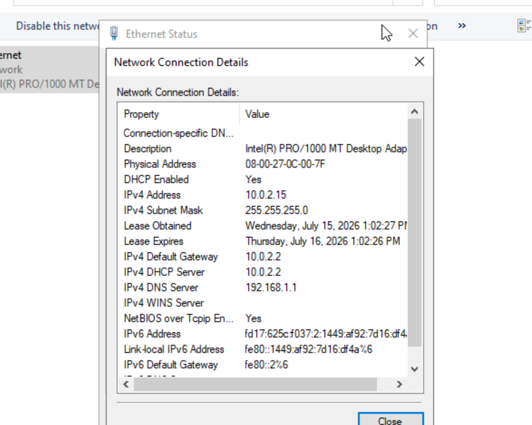
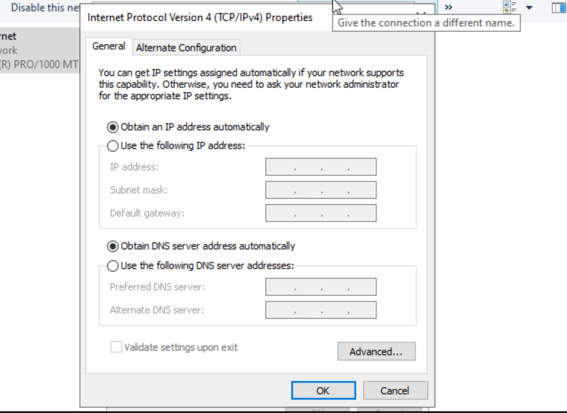
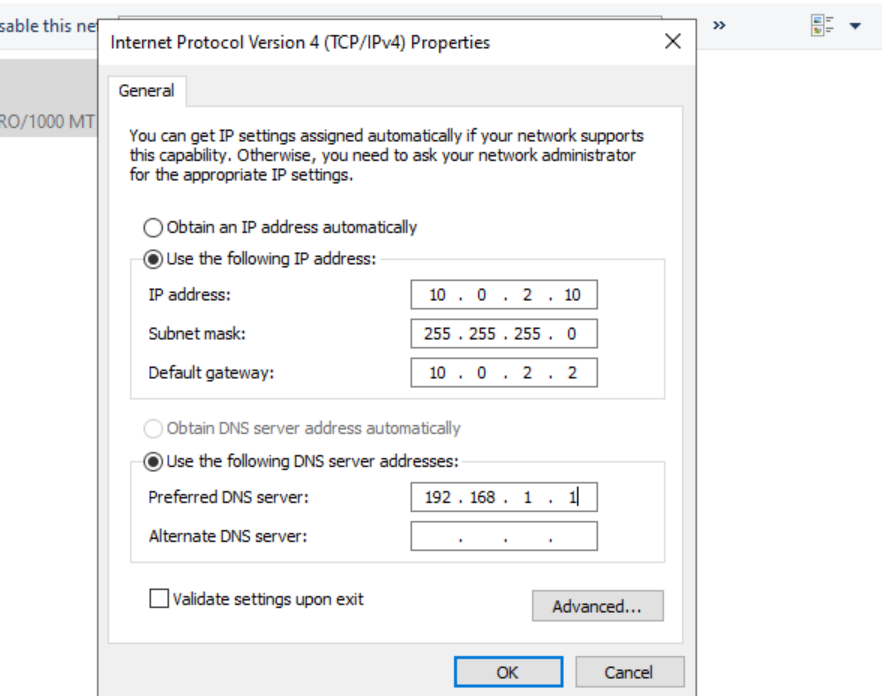

# Lab 02 - Configure Static IP

## Objective

Configure a static IPv4 address before deploying Active Directory.

---

## Environment

- Windows Server 2022 Standard Evaluation
- Oracle VirtualBox

---

## Network Configuration

| Setting | Value |
|---------|-------|
| IP Address | 10.0.2.10 |
| Subnet Mask | 255.255.255.0 |
| Default Gateway | 10.0.2.2 |
| Preferred DNS | 192.168.1.1 |

---

## Reasoning

- Domain Controllers should use a static IP address.
- A static IP ensures clients can reliably locate the Domain Controller.
- The DNS server will remain unchanged until the DNS role is installed.

---

## Screenshots

### Network Adapter Details

### IPv4 Static Configuration

### Local Server

